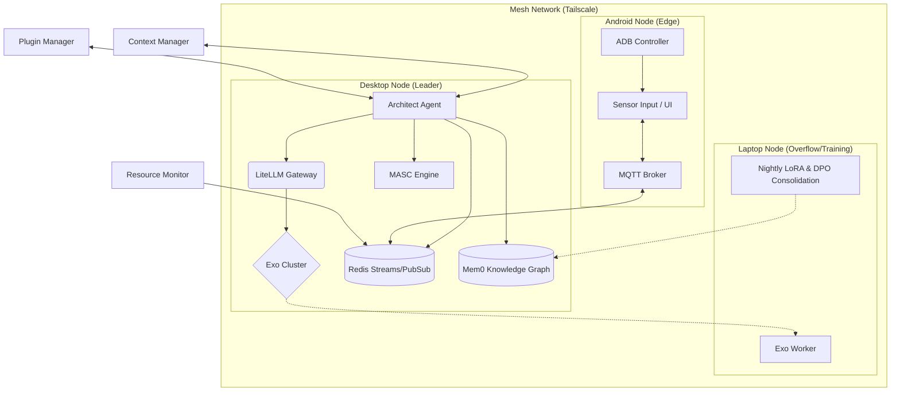

# aOS Architecture

## Overview

aOS (Agentic Operating System) is a 3-node local AI fabric that coordinates inference, memory, and edge control across desktop, laptop, and Android nodes.

## System Architecture



## Component Descriptions

### Desktop Node (Primary GPU Node - Leader)

| Component | Description |
|-----------|-------------|
| **Architect Agent** | Top-level orchestrator running the main planning loop. Polls Redis task queue, plans via LiteLLM, dispatches subtasks |
| **LiteLLM Gateway** | Unified OpenAI-compatible endpoint for all LLM operations (planning, embeddings, summarization) |
| **Exo Cluster** | Tensor-parallel inference cluster for running large models |
| **Redis Streams/PubSub** | Message bus for task queuing, migration streams, and inter-node communication |
| **Mem0 Knowledge Graph** | Graph-based memory system for storing decision traces across sessions |
| **MASC Engine** | Memory-Aware Self-Correction engine for detecting logic failures |

### Laptop Node (Secondary GPU Node)

| Component | Description |
|-----------|-------------|
| **Exo Worker** | Secondary inference worker for overflow tasks |
| **Nightly LoRA & DPO Consolidation** | Self-improvement pipeline that runs overnight: generates DPO datasets, trains LoRA adapters, dreams synthetic queries |

### Android Node (Edge Node)

| Component | Description |
|-----------|-------------|
| **Sensor Input / UI** | Mobile sensors and UI automation capabilities |
| **MQTT Broker** | Mosquitto broker for edge telemetry and messaging |
| **ADB Controller** | Android Debug Bridge controller for device control |

### Cross-Cutting Components

| Component | Description |
|-----------|-------------|
| **Context Manager** | Agent context window compression and fast restore using Redis + LiteLLM |
| **Plugin Manager** | Runtime skill acquisition for dynamic capability loading |
| **Resource Monitor** | Unified telemetry collection from all nodes (CPU, RAM, VRAM, thermal, battery) |

## Data Flows

### Task Execution Flow

1. **Task Submission**: Tasks submitted to Redis stream `tasks:pending`
2. **Planning**: Architect Agent polls queue, breaks down task via LiteLLM
3. **Routing**: ClusterManager selects best node based on headroom scores
4. **Dispatch**: Subtasks published to `tasks:{node_id}` stream
5. **Execution**: Node executes subtask, stores decision trace in Mem0
6. **Monitoring**: ResourceMonitor publishes telemetry to Redis + MQTT

### Memory Flow

1. **Store**: Decision traces embedded via LiteLLM, upserted to Mem0
2. **Retrieve**: Semantic search over traces for context
3. **Summarize**: LiteLLM generates session summaries for long contexts

### Self-Correction Flow

1. **Detect**: MASC Engine embeds expected vs actual outputs
2. **Compare**: Cosine distance computed, threshold checked
3. **Correct**: If failed, retrieve 3 recent traces, generate correction via LiteLLM

### Nightly Cycle Flow

1. **DPO Generation**: Query Mem0 for self-corrected traces → build DPO pairs → save JSONL
2. **LoRA Training**: Load base model + DPO data → train LoRA adapter → save to disk
3. **Synthetic Dreaming**: Analyze topics → generate next-day queries → prefetch to Redis

## Network Topology

All nodes communicate over Tailscale mesh VPN:

```
Desktop (100.x.x.x) ←→ Laptop (100.x.x.x) ←→ Android (100.x.x.x)
       ↓                      ↓                    ↓
   Exo Cluster           Exo Worker          ADB + MQTT
```

## Service Ports

| Service | Port | Protocol |
|---------|------|----------|
| Redis | 6379 | Redis |
| MQTT | 1883 | MQTT |
| LiteLLM | 4000 | HTTP |
| Mem0 | 8000 | HTTP |
| Qdrant | 6333 | gRPC |
| Exo | 8080 | HTTP |

## Configuration

See `config/__init__.py` for Pydantic models:
- `SystemConfig`: Root configuration
- `NodeConfig`: Per-node settings
- `ThresholdsConfig`: Operational thresholds

Environment variables are loaded from `.env` files with `pydantic-settings`.
